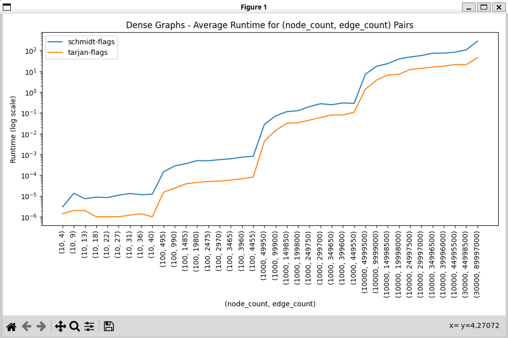
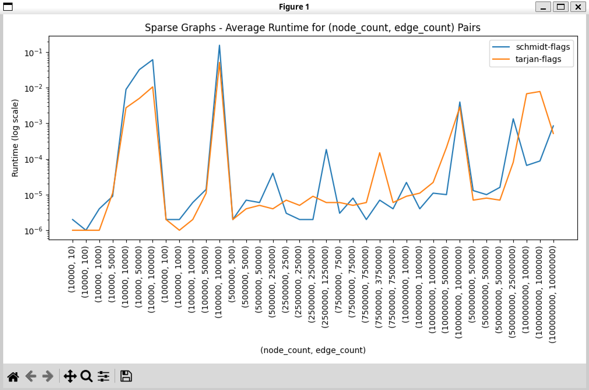
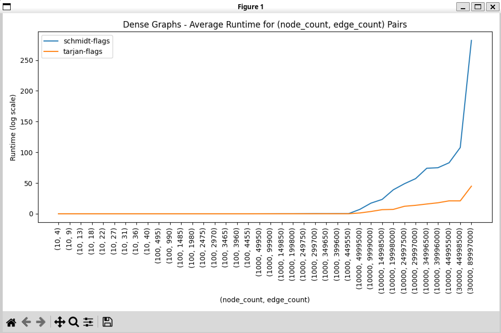
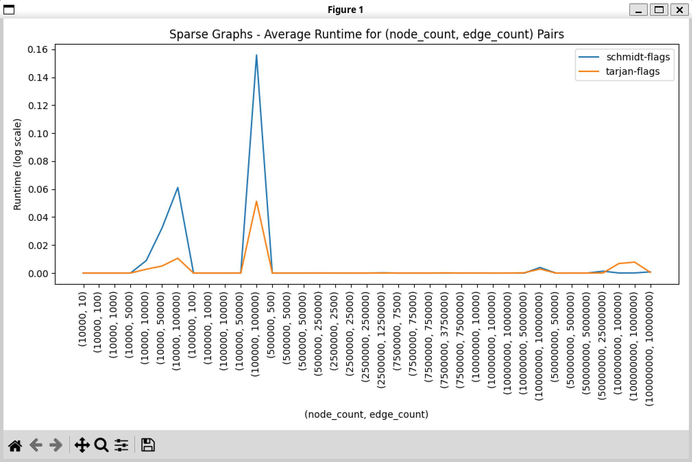

# REPORT

## `Assumptions`

* We have assumed that the project does not include computing the exact biconnected components in either of the algorithms from the given problem statement

* Assumed that the `maximal optimisation` is the NOT final aim of the project's scope and rather focusing on how both the algorithms are differing in performance in different types of graphs with various sizes of number of nodes & edges

* Assumed that the performances are supposed to be marked on one `single system` for consistency in testing purposes in terms of memory architecture and other affecting factors. Further, it has been carried out only from out of the systems that we were able to access directly (_ie. our personal systems_)


## `Definitions`

**Sparse graphs** : considering a range of number of edges with respect to number of nodes to be categorised as `Sparse`. The range is as follows,

$$0.1*O(N)\ <=\ |E| <=\ 10*O(N)$$


**Dense graphs** : considering cases as large as the following range; $[3*10^{4},\ 10^{8}]$. So, by the typical definition of any dense graph having $O(N^{2})$ edges is not computationally feasible.

Otherwise, we are testing for as many dense cases as feasible!


## `Tarjan's Algorithm`

### Overview
Tarjan's algorithm is used to find articulation points in a graph, which are points that, when removed, increase the number of connected components in the graph. It also helps in determining whether a graph is biconnected, meaning it remains connected even after removing any single vertex.

### How it Works

1. **Depth-First Search (DFS):**
   - Tarjan's algorithm employs a modified depth-first search traversal of the graph.
   - It maintains several arrays to track information about each node during the traversal.

2. **Tracking Information:**
   - Visited Array : _Tracks whether a node has been visited during the DFS._
   - Discovery Time Array : _Records the time when each node is first encountered during the DFS._
   - Low Value Array : _Stores the smallest discovery time reachable from the current node, including itself._
   - Parent Array : _Keeps track of the parent node of each node in the DFS tree._

3. **DFS Traversal:**
   - Start the DFS traversal from a chosen starting node.
   - As the DFS progresses, it assigns discovery times and updates low values for each node.
   - These values are crucial for identifying articulation points later.

4. **Identifying Articulation Points:**
   - During the DFS, whenever a back edge to an ancestor is found, the low value of the current node is updated to reflect the earliest node reachable from both the current node and its ancestor.
   - An articulation point is identified if any of the following conditions hold:
     - The current node is the root of the DFS tree, and it has more than one child.
     - The current node is not the root, and its low value is greater than or equal to its discovery time.

5. **Checking Biconnectivity:**
   - After the DFS traversal, if any articulation points are found or if not all nodes were visited, the graph is not biconnected.
   - Otherwise, the graph is biconnected.

### Example
Consider a simple graph with five vertices:
```
0 -- 1
|  / |
| /  |
2 -- 3
```
- Starting from node 0, the DFS traversal proceeds to node 1, then to node 2, then to node 3, and backtracks to node 2.
- During this traversal, discovery times and low values are updated for each node.
- Node 2 has a back edge to its ancestor, node 0, so its low value is updated.
- After the traversal, node 2 is identified as an articulation point because its low value is greater than its discovery time.
- Since an articulation point is found, the graph is not biconnected.

### Observations

- Time complexity: $O(V+E)$
- Space complexiy: $O(V)$


## `Schmidt's Algorithm`

### Overview
Schmidt's algorithm is used to determine whether a graph is biconnected. It works by performing depth-first search (DFS) and identifying certain structures called "ears" to check for biconnectivity.

### How it Works

1. **Depth-First Search (DFS):**
   - Schmidt's algorithm begins with a DFS traversal of the graph.
   - During this traversal, it constructs two directed graphs:
     - `directedGraphEdges`: Contains directed edges from each node to its children.
     - `directedGraphBackEdges`: Contains directed edges representing back edges found during the DFS.

2. **DFS Traversal and Back Edges:**
   - During the DFS, whenever a back edge (an edge to an ancestor in the DFS tree) is encountered, it is added to `directedGraphBackEdges`.
   - The algorithm also maintains a `visitedTime` map to record the order in which nodes are visited during the DFS.

3. **Identifying Ears:**
   - After the DFS, the algorithm iterates over the visiting order of nodes.
   - For each node, it selects back edges and performs a "deep move" to construct ears.
   - A deep move involves removing edges from the `directedGraphEdges` to form ears.
   - Each ear is stored as a sequence of nodes.

4. **Checking Biconnectivity:**
   - The algorithm counts the number of ears formed and checks for cycles.
   - If more than one cycle is found or the number of ear edges does not match the original graph's edge count, the graph is not biconnected.
   - Additionally, it checks if all edges in the `directedGraphEdges` are removed, indicating biconnectivity.

### Example
Consider a simple graph with five vertices:
```
0 -- 1
|  / |
| /  |
2 -- 3
```
- Schmidt's algorithm first performs a DFS traversal.
- Back edges are identified, and ears are constructed.
- If only one cycle is found and the number of ear edges matches the original graph's edge count, the graph is considered biconnected.

### Observations

- Time complexity: 
   - The DFS function has a time complexity of $O(V+E)$ as it traverses each vertex and each edge exactly once.
   - The deepMove function has $O(E)$ complexity in the worst case.
   - So, total time complexity is $O(V+E)$
- Space complexiy: $O(V)$


## `Test-cases`
As mentioned above, we have tried to perform extensive testing on as many variety of graphs as possible using our own generated random graph generator function.

1. **Sparse Graphs**

    - We've picked nodes of sizes ranging from `[10000, 100000, 500000, 2500000, 7500000, 10000000, 50000000, 100000000](10k to 100 million)` with edge sizes for each node ranging from the multipliers of `[0.001, 0.01, 0.1, 0.5, 1, 5, 10]`
        - For example, for a graph with 100 million nodes, we've benchmarked the following edges - `[100k, 1 million and so on till 1 billion]`
        - The maximum we've been able to benchmark were graph sizes with `100 million nodes and 10 million edges` and `50 million nodes and 25 million edges`.

2. **Dense Graphs**
    - We've picked nodes of sizes ranging from `[10, 100, 1000, 10000, 30000, 60000, 100000]` with edge sizes proportional to a density range between `[0.1, 0.9]` with increments of `0.1`.
      - The maximum we've been able to benchmark were the graph sizes with `30000 nodes and 90 million edges`.

## `Performance Plots`

### Log scale plots:



### Linear scale plots:



## `Additional work`

Initially, We've written a different variant of schmidt's algorithm which sorts the back-edges after the DFS traversal is done. This added extra runtime due to the additional ElogE sorting performed, and has been duly rectified in the current implementation. 

## `Conclusion`

As seen per the performance plots, we notice that there isn't much difference between the runtimes of Tarjan's and Schmidt's algorithms in the case of sparse graphs. 

Although we see heavy performance gains with Tarjan over Schmidt in the case with dense graphs.  

## `References`
* [Ramachandra's ear decomposition blog](https://codeforces.com/blog/entry/80932)
* [Jen Schmidt's paper](https://arxiv.org/abs/1209.0700)
* [Tarjan's biconnectivity paper](https://ieeexplore.ieee.org/document/4569669)